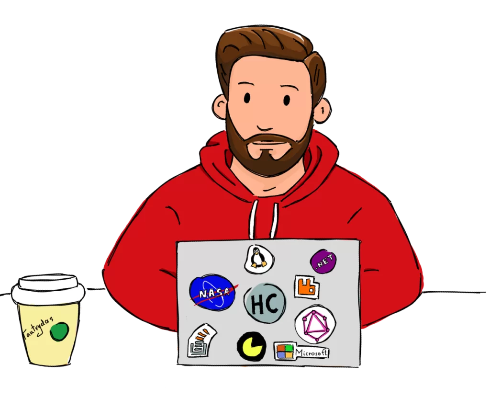

### Hi there   I'M Denis Nganga,

<picture></picture><b></b>

  -----  -----

   
  

  

# 💫 About Me:
Happiness😊!!   How happy would you be if you see the world transforming due to the power of tech??, Imagine you being part of transforming the world. Isn't it sweet?? As a developer,I have fallen in love with the power of solving problems and being part of innovation. I'm passionate about the power of transforming lives through tech. I acquire skills in deep learning using PyTorch and creating web applications with Django. i also got a knowledge in containerized containers using docker you can view my personal  [portfolio](https://denisngangaportfolio.netlify.app) you can also reach me out through my [email](denisnganga16@gmail.com) or even get in touch with me through social media platform i.e [LinkedIn](https://www.linkedin.com/in/denis-nganga16)  Lets join hands and make the world a better place through tech. Thanks for visiting my profile.Dont forget to be part to connect with me

## 🌐 Socials:
     

# 💻 Tech Stack:
           
# 📊 GitHub Stats:
 
 

## 🏆 GitHub Trophies

### ✍️ Random Dev Quote

### 🔝 Top Contributed Repo

  
<!-- Proudly created with GPRM ( https://gprm.itsvg.in ) -->
